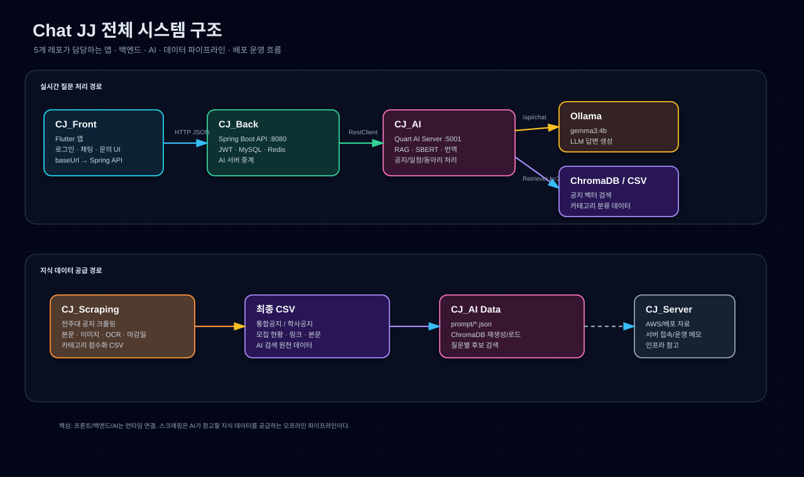
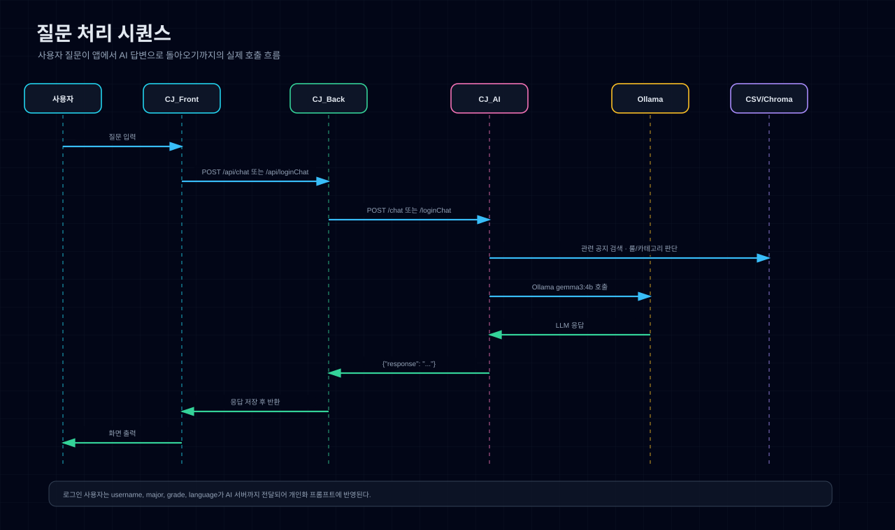
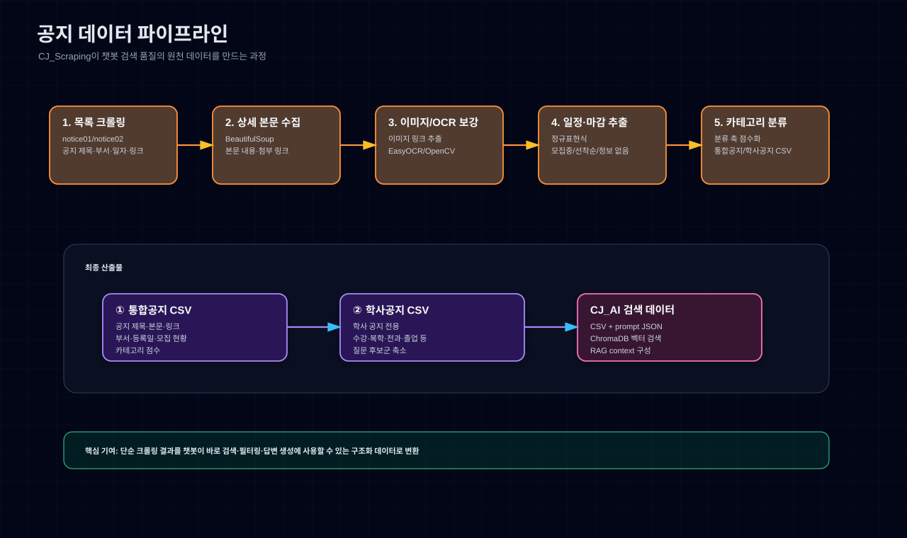

# Chat JJ 전체 시스템 구조

이 문서는 `Chat JJ` 캡스톤 프로젝트의 전체 구조를 한눈에 설명하기 위해 정리한 자료입니다. 현재 이 레포는 크롤링/데이터 파이프라인 중심 포트폴리오 저장소이지만, 실제 팀 프로젝트는 프론트엔드, 백엔드, AI 서버, 데이터 수집, 배포 자료가 각각 분리된 5개 레포로 구성되었습니다.

## 1. 전체 아키텍처



전체 서비스는 두 흐름으로 나뉩니다.

1. 실시간 질문 처리 경로
   - 사용자가 Flutter 앱에서 질문 입력
   - Spring Boot 백엔드가 요청 수신
   - 백엔드가 AI 서버로 질문 중계
   - AI 서버가 RAG, 룰 기반 처리, Ollama LLM 호출을 조합해 답변 생성
   - 백엔드가 답변과 채팅 이력을 저장한 뒤 앱에 반환

2. 지식 데이터 공급 경로
   - 크롤링 노트북이 전주대학교 공지 데이터를 수집
   - 본문, 이미지, OCR, 마감일, 카테고리 정보를 정리
   - 최종 CSV가 AI 서버의 검색/RAG 원천 데이터로 사용
   - ChromaDB와 카테고리 분류 로직이 질문과 관련된 공지를 좁히는 데 사용

## 2. 레포별 역할

| 레포 | 담당 영역 | 핵심 역할 |
|---|---|---|
| `CJ_Front` | Flutter 앱 | 로그인, 회원가입, 챗봇 화면, 문의 화면, 다국어 UI |
| `CJ_Back` | Spring Boot API | 인증, JWT, MySQL/Redis 저장, 채팅 API, AI 서버 중계 |
| `CJ_AI` | Quart AI 서버 | RAG, SBERT 유사도, ChromaDB 검색, Ollama 호출, 다국어 응답 |
| `CJ_Scraping` | 데이터 수집 파이프라인 | 전주대 공지 크롤링, 본문/OCR/마감일 추출, 카테고리 분류 CSV 생성 |
| `CJ_Server` | 서버/배포 자료 | AWS 서버 접속, 배포, 운영 환경 관련 참고 자료 |

## 3. 질문 처리 시퀀스



사용자 질문은 다음 순서로 처리됩니다.

```text
사용자
→ CJ_Front
→ CJ_Back /api/chat 또는 /api/loginChat
→ CJ_AI /chat 또는 /loginChat
→ ChromaDB/CSV 검색
→ Ollama LLM 호출
→ CJ_AI response 반환
→ CJ_Back DB 저장 및 응답 반환
→ CJ_Front 화면 출력
```

비로그인 사용자는 질문만 전달됩니다.

```json
{
  "question": "장학금 공지 알려줘"
}
```

로그인 사용자는 개인화에 필요한 정보가 함께 전달됩니다.

```json
{
  "username": "user01",
  "question": "내 학과랑 관련된 공지 알려줘",
  "major": "컴퓨터공학과",
  "grade": 3,
  "language": "한국어"
}
```

이 정보는 AI 서버의 프롬프트에 반영되어 학년, 학과, 언어 기반 답변을 만드는 데 사용됩니다.

## 4. 데이터 파이프라인



이 레포에서 정리한 핵심 기여는 위 데이터 파이프라인입니다.

파이프라인 단계는 다음과 같습니다.

1. 공지 목록 크롤링
   - 전주대 통합공지/학사공지 목록 페이지 순회
   - 제목, 부서, 등록일, 상세 링크 수집

2. 상세 본문 수집
   - 상세 페이지의 본문 텍스트 추출
   - 첨부 링크와 메타데이터 정리

3. 이미지/OCR 보강
   - 이미지 중심 공지에서 이미지 링크 추출
   - OCR로 이미지 안의 텍스트를 보완

4. 일정·마감일 추출
   - 정규표현식 기반 날짜 후보 추출
   - 모집중, 선착순, 정보 없음 등 상태 정보 정리

5. 카테고리 분류
   - 공지 제목, 본문, 부서 정보를 기준으로 분류 축 점수화
   - 질문 검색 시 후보군을 좁힐 수 있는 CSV 구조 생성

최종 산출물은 다음 두 파일입니다.

| 파일 | 역할 |
|---|---|
| `①_통합공지+카테고리분류(3-2-0-2).csv` | 통합공지 기반 RAG/검색 원천 데이터 |
| `②_학사공지+카테고리분류(3-2-0-2).csv` | 학사공지 기반 RAG/검색 원천 데이터 |

## 5. 백엔드와 AI 서버의 실제 연결

백엔드는 Flutter 앱에서 받은 요청을 AI 서버로 중계합니다.

```text
CJ_Front → CJ_Back
POST /api/chat
POST /api/loginChat
```

```text
CJ_Back → CJ_AI
POST http://localhost:5001/chat
POST http://localhost:5001/loginChat
```

AI 서버는 내부에서 Ollama를 호출합니다.

```text
CJ_AI → Ollama
POST http://localhost:11434/api/chat
model = gemma3:4b
```

AI 서버는 CSV와 ChromaDB에서 관련 공지를 찾고, 그 결과를 LLM 프롬프트의 context로 넣어 답변을 생성합니다.

## 6. 데이터 파이프라인의 프로젝트 내 의미

이 프로젝트에서 크롤링 파트는 단순히 웹 페이지를 수집하는 기능이 아닙니다. AI 챗봇이 정확한 답변을 하기 위한 지식 기반을 만드는 역할입니다.

특히 다음 지점에서 서비스 품질과 직접 연결됩니다.

- 최신 공지를 챗봇 검색 대상으로 제공
- 본문과 이미지 기반 정보를 함께 보강
- 마감일과 모집 상태를 추출해 사용자 질문에 더 직접적으로 응답
- 카테고리 점수화를 통해 질문 의도와 관련된 공지를 빠르게 좁힘
- RAG와 SBERT 기반 검색이 사용할 수 있는 구조화 데이터를 제공

## 7. 개선 방향

운영형 서비스로 확장한다면 다음 개선이 필요합니다.

| 영역 | 개선 방향 |
|---|---|
| 환경설정 | 프론트 baseUrl, 백엔드 AI 서버 URL, AI BASE_DIR을 환경변수로 분리 |
| 보안 | JWT secret 환경변수화, 비밀번호/토큰 로그 제거, 회원정보 수정 API 인증 적용 |
| 데이터 갱신 | 크롤링 → CSV 생성 → ChromaDB 재생성 → AI 서버 반영 자동화 |
| 레포 정리 | 실험 파일과 최종 실행 파일 분리, 데이터 산출물 관리 기준 정리 |
| 배포 | Nginx, Spring Boot, AI 서버, MySQL, Redis, Ollama의 실행 구조 표준화 |

## 8. 한 줄 요약

`Chat JJ`는 `Flutter 앱 → Spring Boot 백엔드 → Quart AI 서버 → Ollama/ChromaDB/CSV`로 이어지는 AI 챗봇 서비스이며, 이 레포의 크롤링/분류 파이프라인은 챗봇이 신뢰할 수 있는 공지 데이터를 검색하고 답변하도록 만드는 기반 역할을 합니다.
